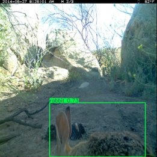
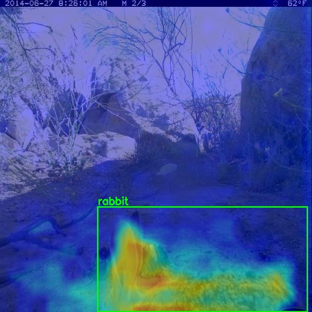
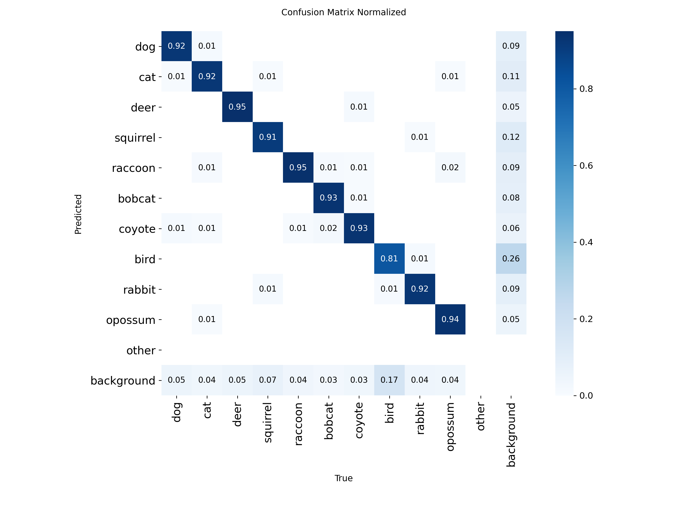

# Detección y clasificación automatizada de fauna salvaje mediante imágenes de cámaras trampeo fotográficas

---

## **Resumen**
En estudios de monitorización de fauna salvaje el análisis y clasificación manual de las fotografías mediante cámaras de trampeo es una tarea muy costosa. En este trabajo se desarrolla un sistema automático para la detección y clasificación de diez especies de animales diferentes mediante el uso de técnicas de aprendizaje profundo. Para ello, se utilizan diferentes métodos de aprendizaje por transferencia en modelos preentrenados basados en la arquitectura YOLOv5, junto con un preprocesado y aumento de los datos para mejorar los resultados. También se analizan diferentes configuraciones del entrenamiento y tamaños del conjunto de datos con el objetivo de optimizar el rendimiento y precisión del sistema. Además, el código desarrollado durante el proyecto se encuentra disponible en un repositorio GitHub público.

**Palabras claves** Aprendizaje por transferencia, aprendizaje profundo, cámaras trampeo, clasificación de especies, inteligencia artificial.

## **Abstract**
In wildlife monitoring studies, the manual analysis and classification of the photographs taken by camera traps is a very costly task. This work develops an automated system for the detection and classification of ten different animal species using deep learning techniques. To achieve this, different transfer learning methods are used on pretrained models based on the YOLOv5 architecture, along with data preprocessing and augmentation to improve results. Different training configurations and dataset sizes are also analysed to optimize the system’s performance and accuracy. In addition, the code develop during this project is available in a public GitHub repository. 

**Index Terms** Artificial intelligence, camera trap, deep learning, species classification, transfer learning.

---

## **Como reproducir el proyecto**

- Descargar el dataset Caltech Camera Traps. https://lila.science/datasets/caltech-camera-traps/

- Crear un entorno anaconda en python3.10 y entrar en él.

- Instalar las librerias en requirements.txt con pip.

- Cambiar los nombres de los path del código.

- Ejecutar el archivo bash.

---

## **Resultados**

<table> <tr> <td align="center">   <b>Predicción de imagen del dataset</b> </td> <td align="center">   <b>Activation Map de imagen del dataset</b> </td> </tr> </table>   
   <b>Confusion Matrix del mejor modelo del proyecto</b> 

---

## **Autor y Tutor**

- Autor: Adrián Martínez García

- Tutor: Mehmet Oguz Mulayim
